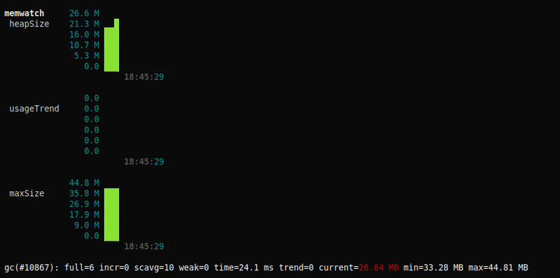

# Quickly watch real-time memory stats of your nuxt app
<!-- <a href="https://travis-ci.org/pimlie/nuxt-memwatch"></a> -->
[](https://www.npmjs.com/package/nuxt-memwatch)
[](https://www.npmjs.com/package/nuxt-memwatch)

## Why and when do you use this module

Other tools may provide the same or better functionality, but this module is probably the quickest way to get more insights in the memory usage of your nuxt server. Especially when using the node-memwatch peerDependency it could help you track down memory leaks. Also see the [node-memwatch](https://github.com/airbnb/node-memwatch) readme for more information

<p align="center"></p>

## Setup
> :information_source: Please note you dont need to re-build your project when en-/disabling this module, you only need to restart the server

##### Install
```
npm install --save nuxt-memwatch
// or
yarn add nuxt-memwatch
```

##### Install the peerDependencies (recommended)
```
npm install --save @airbnb/node-memwatch
// or
yarn add @airbnb/node-memwatch
```

##### Add `nuxt-memwatch` to `modules` section of `nuxt.config.js`
```js
  modules: [
    ['nuxt-memwatch', { graph: false }],
  ]
```
or 
```js
  modules: [
    'nuxt-memwatch'
  ],
  memwatch: {
    setupGraph(graphSetup) {
      graphSetup.metrics.malloc = {
        aggregator: 'avg',
        color: 'cyan'
      }
    },
    graphMetric(graph, stats) {
      graph.metric('my metrics', 'malloc').push(stats.malloced_memory)
    }
  }
```

## Module Options

#### `graph` _boolean_ (true)

If true then we print time-based graphs for the heap statistics, if false then we log the stats as normal text (and `verbose: true`, see below)

#### `verbose` _boolean_ (true)

If true then we listen for the stats event from node-memwatch and display real time gc statistics

#### `graphOnGC` _boolean_ (false)

If true then the graph is updated when a stats event is received from node-memwatch. The graph is updated every 1 second, to match that interval we add the metrics by default also every second. As gc stats might not be available, we use `[v8.getHeapStatistics](https://nodejs.org/api/v8.html#v8_v8_getheapstatistics)` to retrieve the stats. This gives us a nice resolution, but this method returns actual heap statistics (as in, there might be memory which node could release but just hasnt yet).
When you are hunting down a memory leak, the heap usage just after the gc has run gives you a better understanding of your app's memory usage (with a lower resolution as trade off)

#### `averages` _boolean_ (false)

If true then we calculate and log long standing averages (think of uptime with eg 1min, 5min averages but with number of stats). This option is ignored when `graph: true` 

#### `heapAverages` _[number]_ ([10, 50, 100])

If `averages: true, graph: false` then we will print averages for each of these number of stats events.

#### `useMovingAverage` _number_ (0)

If set to a number larger then 0 we will calculate the used_heap_size by taking the moving average of this last number of stats events

#### `leakGrowthCount` _number_ (5)

We define a memory leak as when this number of stats events have consecutively been growing the heap size

#### `autoHeapDiff` _boolean_ (false)

If true then we will automatically create a heap diff when a memory leak is detected. The first heap dump is created at leakGrowthCount - 1.

> :fire: Taking heap dumps can be very expensive, you probably shouldnt enable this in production

#### `headerEveryLines` _number_ (25)

How often we print a header with column names when `graph: false, verbose: true`

#### `gcAfterEvery` _number_ (0)

If set to a number larger then 0, we will force the gc to run after this number of requests. E.g. when set to 1 the gc runs after every request

> :fire: This only works when you have either installed the peerDependency or are running node with `--expose_gc`

#### `gcOnInterrupt` _boolean_ (true)

If true then the gc is run when a user signal is sent to the running process

> :information_source: send `SIGUSR2` except on Windows use `SIGBREAK`

#### `heapDiffOnInterrupt` _boolean_ (false)

If true then you can create a heap diff by sending an user signal to the running process. You will always need to sent two signals for both the start heap dump as the end heap dump. The heap diff will then be calculated and logged

> :information_source: send `SIGUSR2` except on Windows use `SIGBREAK`

#### `nuxtHook` _string_ (listen)

Normally we are interested in memory usage when nuxt is serving requests, so we start listening for stats events on the listen hook. You can probably leave this to the default

#### `setupGraph` _function_ (undefined)

If defined it receives the graph setup as the first argument. Use this to setup your own metrics

> See the readme of [turtle-race](https://github.com/lbovet/turtle-race) and [zibar](https://github.com/lbovet/zibar) for more information

#### `graphMetric` _function_ (undefined)

If defined it receives the graph as first argument, the stats as second argument and the number of requests as third argument. Use this to add your own metrics, see the example in [setup](#add-nuxt-memwatch-to-modules-section-of-nuxtconfigjs)
